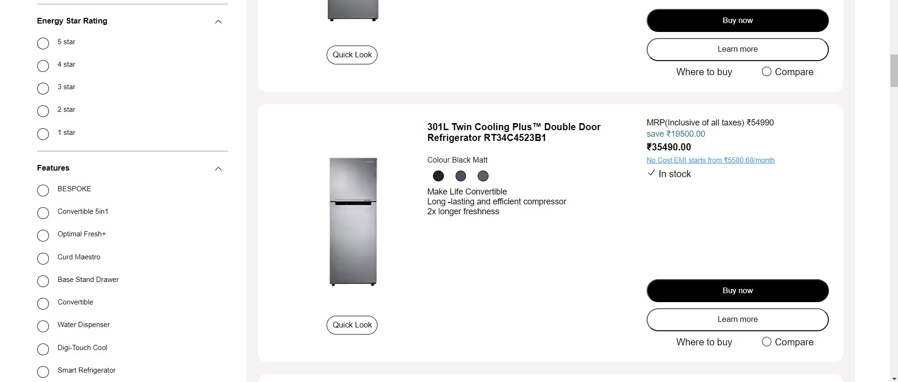

# TEAM SAMSUNG 🚀

**Team Members:**
1. [FAIZ ANSARI](https://www.linkedin.com/in/mohammad-faiz-ansari-1b67a8170) (Captain)🏴‍☠️
2. [RAUSHAN RAJ](https://www.linkedin.com/in/raushanraj723/)
3. [SURAJ KUMAR](https://www.linkedin.com/in/suraj-kumar-5b34a61b3/)
4. [PRATHAM SONI](https://www.linkedin.com/in/pratham-soni-1a58a5210/)
5. [MAYUR BHOYAR](https://www.linkedin.com/in/mayur-bhoyar-b14b97222/)

---

# SAMSUNG Shop Section 🎥

**File Structure:**
- **index.html:** The main HTML file containing the structure of the webpage.
- **style.css:** The stylesheet file for styling the webpage.
- **img/:** Directory containing image files used in the webpage.
- **README.md:** Documentation file for the project.

---

## HTML Tags Used

**Semantic Tags:**
- `<main>`
- `<section>`
- `<strong>`

**Non-Semantic Tags:**
- `
`
- `<button>`
- `<h1>`, `<h2>`, `<h3>`, `<h4>`, `<h5>`,`<h6>`
- `
`
- ``
- `<a>`
- ``
- `<script>`
- `<svg>`
- `<link>`

---

## External Packages

- 🎭 **GOOGLE FONT** for Fonts.

## Development Stack

- 🌐 **HTML** and 🎨 **CSS** for structuring and styling web content.

## Features

- 📱 **UI Clone:** All pages are designed to provide a seamless experience.

---

## Learning and Insights

- 🚀 **HTML:** Learned to enhance my coding experience by using different tags and naming conventions.
- 🎨 **CSS:** Gained expertise in making web pages by using css properties to my code.

---

## Screenshots

 
 

 
 

 
 

 
 

 
 

 
 

 
 

 
 

 
 

 